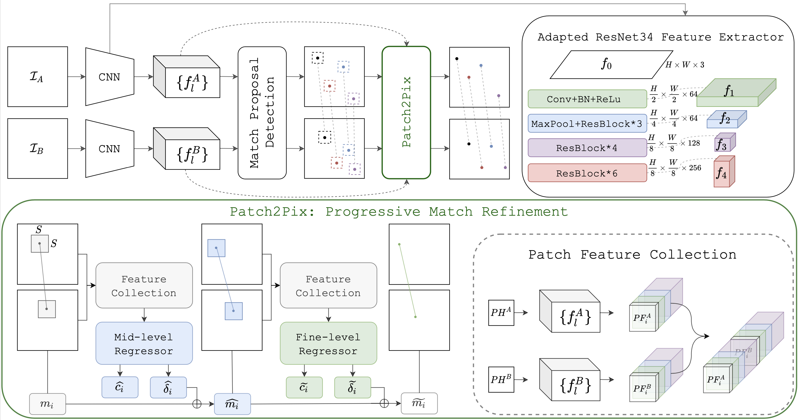

# Patch2Pix for Accurate Image Correspondence Estimation
This repository contains the Pytorch implementation of our  paper accepted at CVPR2021: Patch2Pix: Epipolar-Guided Pixel-Level Correspondences. [[Paper]](https://arxiv.org/abs/2012.01909) [[Video]](https://www.youtube.com/watch?v=Qxkyjsgi8xY).


To use our code, first download the repository:
````
git clone git@github.com:GrumpyZhou/patch2pix.git
````
## Setup Running Environment
The code has been tested on  Ubuntu (16.04&18.04) with Python 3.7 + Pytorch 1.7.0  + CUDA 10.2.  
We recommend to use *Anaconda* to manage packages and reproduce the paper results. Run the following lines to automatically setup a ready environment for our code.
````
conda env create -f environment.yml
conda activte patch2pix
````

### Download Pretrained Models
In order to run our examples, one needs to first download our pretrained Patch2Pix model. To further train a Patch2Pix model, one needs to download the pretrained NCNet. We provide the download links in  [pretrained/download.sh](pretrained/download.sh).
To download both, one can run
````
cd pretrained
bash download.sh
````

## Evaluation
**❗️NOTICE❗️:** In this repository, we only provide examples  to  estimate correspondences using our Patch2Pix implemenetation. 

To reproduce our evalutions on **HPatches**, **Aachen** and **InLoc** benchmarks, we refer you to **our toolbox  for image matching**:  [**image-matching-toolbox**](https://github.com/GrumpyZhou/image-matching-toolbox). There, you can also find implementation to reproduce the results of other state-of-the-art methods that we compared to in our paper.

### Matching Examples
In our notebook [examples/visualize_matches.ipynb](examples/visualize_matches.ipynb) , we give examples how to obtain matches given a pair of images using both **Patch2Pix** (our pretrained) and **NCNet** (our adapted). The example image pairs are borrowed from [D2Net](https://github.com/mihaidusmanu/d2-net), one can easily replace it with your own examples.

## Training
*Notice the followings are necessary **only if** you want to train a model yourself*.
### Data preparation
We use [MegaDepth](https://www.cs.cornell.edu/projects/megadepth/)  dataset for training. 
To keep more data for training, we didn't split a validation set from MegaDepth. Instead we use the validation splits of [PhotoTourism](https://www.cs.ubc.ca/~kmyi/imw2020/data.html).
The following steps describe how to prepare the same training and validation data that we used.
 
**Preapre Training Data**
 1. We preprocess **MegaDepth** dataset following the preprocessing steps proposed by [D2Net](https://github.com/mihaidusmanu/d2-net). For details, please checkout their  *"Downloading and preprocessing the MegaDepth dataset"* section in their github documentation.

 2.  Then place the processed MegaDepth dataset under **data/** folder and name it as **MegaDepth_undistort** (or create a symbolic link for it). 

 3. One can directly download our **pre-computred** training pairs using our download script.
````
cd data_pairs
bash download.sh
````
In case one wants to generate pairs with different settings, we provide notebooks to **generate pairs from scratch**.  Once you finish step 1 and 2, the training pairs can be generated using our notebook [data_pairs/prep_megadepth_training_pairs.ipynb](data_pairs/prep_megadepth_training_pairs.ipynb). 

**Preapre Validation Data**
 1.  Use our script to dowload and extract the subset of train and val sequences from the **PhotoTourism**  dataset.
```
cd data
bash prepare_immatch_val_data.sh
```
 2.  Precompute image pairwise overlappings for fast loading of validation pairs.
```
# Under the root folder: patch2pix/
python -m data_pairs.precompute_immatch_val_ovs \
		--data_root data/immatch_benchmark/val_dense
```

### Training Examples

To train our best model:
````
python -m train_patch2pix --gpu 0 \
    --epochs 25 --batch 4 \
    --save_step 1 --plot_counts 20 --data_root 'data' \
    --change_stride --panc 8 --ptmax 400 \
    --pretrain 'pretrained/ncn_ivd_5ep.pth' \
    -lr 0.0005 -lrd 'multistep' 0.2 5 \
    --cls_dthres 50 5 --epi_dthres 50 5  \
    -o 'output/patch2pix' 
````

The above command will save  the log file and checkpoints to the output folder specified by `-o`. Our best model was trained on a 48GB GPU. 
To train on a smaller GPU, e.g, with 12 GB, one can either set `--batch 1 ` or  `--ptmax 250` which defines the maximum number of match proposals to be refined for each image pair.
However, those changes might also decrease the training performance according to our experience.
Notice, during the testing, our network only requires 12GB GPU.

**Usage of Visdom Server**
Our training script is coded to monitor the training process using Visdom.  To enable the monitoring, one needs to:
1) Run a visdom sever on your localhost, for example: 
```
# Feel free to change the port
python -m visdom.server -port 9333 \
-env_path ~/.visdom/patch2pix
```
2) Append options  `-vh 'localhost' -vp 9333`  to the commands of the training example above.

## BibTeX
If you use our method or code in your project, please cite our paper:
```
@inproceedings{ZhouCVPRpatch2pix,
        author       = "Zhou, Qunjie and Sattler, Torsten and Leal-Taixe, Laura",
        title        = "Patch2Pix: Epipolar-Guided Pixel-Level Correspondences",
        booktitle    = "CVPR",
        year         = 2021,
}
```


